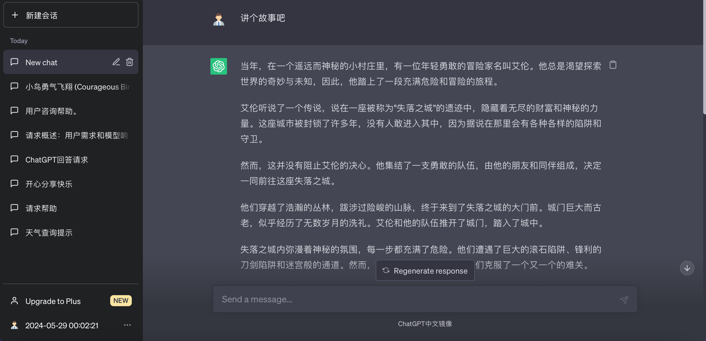
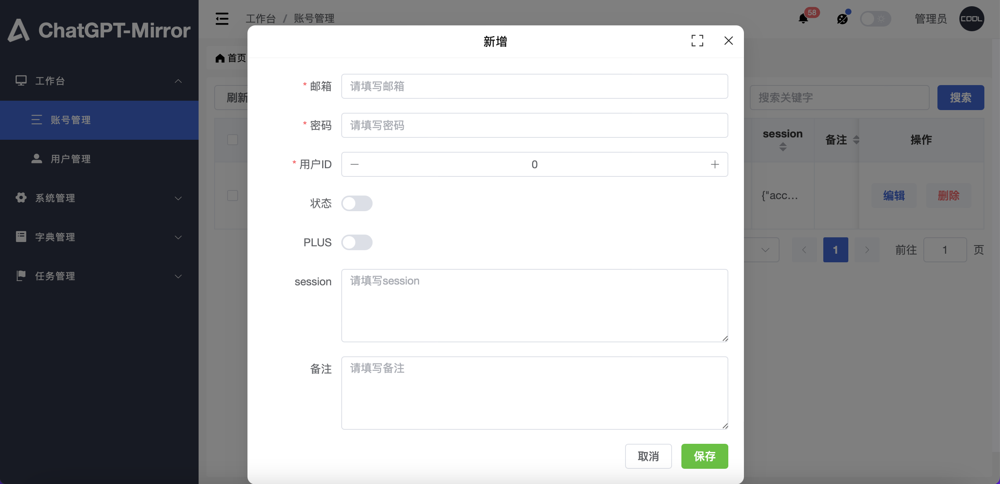
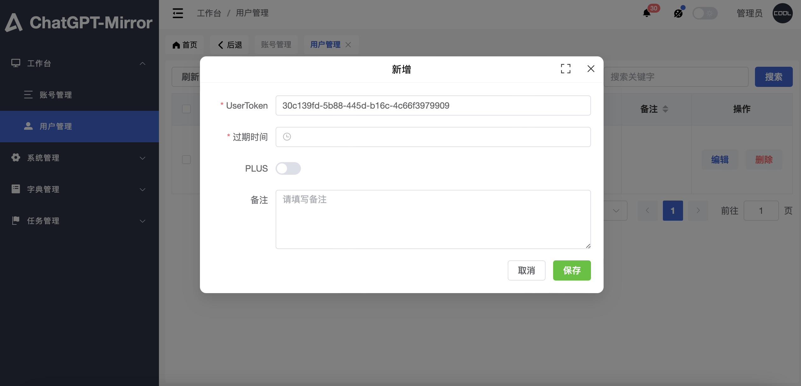

# ChatGPT-Mirror-Server-Deploy

ChatGPT 镜像服务快速部署脚本库

- 我是开发者,我想自行修改功能->前往源码库 [https://github.com/xyhelper/chatgpt-mirror-server](https://github.com/xyhelper/chatgpt-mirror-server)
- 我没服务器,也没有官网账号,只想使用->前往官网购买我们运营的会员服务 [https://www.xyhelper.com.cn](https://www.xyhelper.com.cn)
- 我需要购买服务器->前往观星云购买 [https://www.guanxingyun.com/act/2023618.html](https://www.guanxingyun.com/act/2023618.html)
- 我有服务器,我想自己部署->请继续阅读本文档

## 前置条件

- 一台至少 2 核 2G 内存的服务器,推荐使用香港、新加坡、日本地区的服务器,可以兼顾国内访问。
- 安装了 docker 和 docker-compose
- 安装了 git
- 有官网直登账号(不支持谷歌、微软、苹果等第三方登陆账号)

## 自动部署

在服务器上执行以下命令即可

```bash
```

## 手动部署

1. 克隆本仓库到服务器上

```bash
git clone --depth=1 https://github.com/xyhelper/chatgpt-mirror-server-deploy.git chatgpt-mirror
```

2. 进入目录

```bash
cd chatgpt-mirror
```

3. 启动服务

```bash
./deploy.sh
```

## 使用方法

访问服务器的 8200 端口即可使用

管理后台地址为 http://服务器 ip:8200/xyhelper/

默认用户名密码为 admin/123456

## 界面演示

### 用户界面



### 管理界面





## 加入交流群


